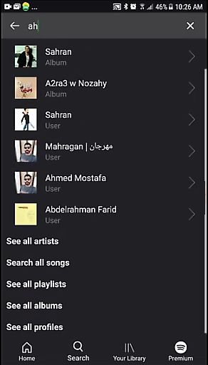
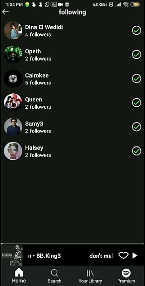

# Spotify El Ghalaba
### This is a spotify's android application clone.

### The project was originally hosted on [gitlab](https://gitlab.com/spotify_el8alaba/android)

### This is a part of a bigger spotify clone including [front-end](https://gitlab.com/spotify_el8alaba/front) and [back-end](https://gitlab.com/spotify_el8alaba/back)

### Note: The application will no longer work as the back-end server hosting subscription has ended

# Screenshots
 | |
:-----------------------------:|:-----------------------------:|:-----------------------------:
 | |
 | |
 | |
 | |

### Prerequisites
- [Android Studio 4 or higher](https://developer.android.com/studio/)
- Minimum SDK version is 21 (Android Lollipop)

### How to run for developers
1. Clone the repository. 
2. Open Android Studio, click on "open" from "File" tab to open the project from the corresponding directory. 
3. Connect a mobile phone to the device and wait for build gradles to finish. 
4. Click on run button from the toolbar.
5. As the mobile phone is turned on, the application can be accessible.

## Running the tests
1. Click on Run tab to choose Edit Configuration. 
2. click on plus (+) icon, select Android Instrumented Tests for UI testing or Andorid JUnit for unit testing.
3. From Module, select app. There are two options; (1) run all tests by select All in module then click Apply and OK. (2) to test a specific package: choose All in package then specify the required package for testing. 
4. More options such as a specific class or method is also available . 
 
## Generating Coverage Report

1. Open a terminal in the root directory
2. Run ` $ ./gradlew createDebugCoverageReport`
 > For Window Users : Use `gradlew.bat` instead of `./gradlew`
3. Now you can find the report in `/build/reports/coverage/debug/index.html`. Open it in the browser.

### Build for production
1. Click on Build tab and select generate signed bunddle/apk.
2. Choose APK and then click on next.
3. In key sotre path choose create new if there is no key store or choose existing.
4. Click next and choose releas then select both v1 and v2 then finish.

### How to generate functional documentation
1. Click on tools tab in toolbar and then select generate JavaDoc
2. Select prefered options to generate the required JavaDoc
3. Specify the output directory then click OK

### Used Tools and technologies
- Retrofit (Connection with REST API)
- Picasso (Download and display images)
- gson (JSON Serialization and Deserialization)
- Espresso (UI testing)
- MVVM Architectural Design Pattern
- Singleton Design Pattern
